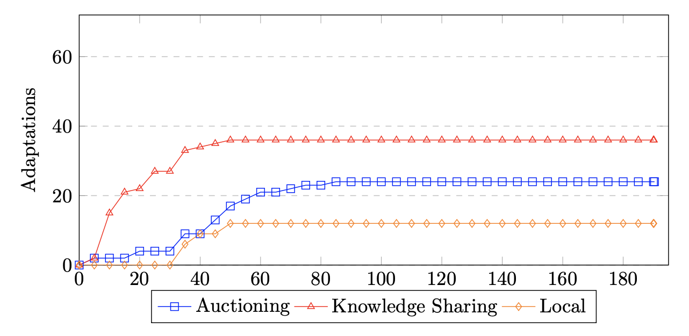

# ADRIAN: Automated decentralized management of cybersecurity risks

This is the repository for the ADRIAN project, containing the source code and results of the research project.

## Authors

- Sven Smolka (1)
- Jorn J. Verhoeven (2)
- Zoltán  Ádám Mann (2)

1. University of Duisburg-Essen, Essen, Germany
2. University of Amsterdam, Amsterdam, The Netherlands

## Risk Rules

The agents utilize predefined rules to generate an attack graph from the knowledge base, determining when to create risk edges between vertices and their associated probabilities. These rules consider various conditions, such as the attributes and existence of nodes, software components, and links within the knowledge base. Below is a detailed list of all risk rules used in the experiments.

For more information on how the risk rules are used, please refer [this short description](/risk-rules.pdf).

| Name | Rule Type | Pk | Adaptation | Mitigation Probability
| ---- | --------- | ---- | ---- | --- |
| Uncertainty | Inward | 0.08 | N.A. |
| Firewall | Backward | 0.8 | Enable Property | 0.2
| Physically Secured | Backward | 0.8 | Enable Property | 0.2
| Software Encrypted | Backward | 0.8 | Enable Property | 0.2
| CVE-2020-3676 | Forward | 0.8 | Enable Property | 0.2
| CVE-2021-22547 | Forward | 0.18 | Version Change | 0.0
| CVE-2021-40830 | Inward | 0.18 | Version Change | 0.0
| CVE-2022-25666 | Forward | 0.28 | Version Change | 0.0
| CVE-2022-359274 | Backward | 0.08 | Version Change | 0.0
| CVE-2022-359274 | Inward | 0.39 | Version Change | 0.0
| Firmware Risk* | Forward | 0.1 | N.A. |
| OS Risk* | Forward | 0.4 | Version Change | 0.0
| SDK Risk* | Forward | 0.99 | Version Change | 0.0

* These risks are used for testing and are made up, and thus they have no real-world

## Metrics

The following metrics are collected during the experiments:

**Effectiveness metrics**
- Number of unique risks identified
- Number of remaining risks
- Sum of damages of remaining risks

**Efficiency metrics**
- Total number of messages exchanged
- Number of adaptations
- Average time spent auctioning
- Average time spent adapting

## Results

### Scenario 1
In this scenario, no external changes are made to the infrastructure. The purpose of this scenario is to see how the system behaves when no changes are made.

_Fig. 1: This graph shows the overall damage of the system in the scenario where no changes are made overtime._

_Fig. 2: Graph showing the total amount of messages sent between agents in the scenario where no changes are made overtime._

_Fig. 3: Graph showing the total amount of adaptations applied by agents in the scenario where no changes are made overtime._

_Fig. 4: Graph showing the number of unique risks detected by agents in the scenario where no changes are made overtime._

_Fig. 5: Graph showing the number of remaining risks in the infrastructure in the scenario where no changes are made overtime._

_Fig. 6: Graph showing the sum of time spent auctioning by agents in the scenario where no changes are made overtime._

_Fig. 7: Graph showing the sum of time spent adapting by agents in the scenario where no changes are made overtime._

### Scenario 2
This scenario introduces a risk to the infrastructure after 180 seconds. The purpose of this scenario is to see how the system behaves when a new risk is introduced.

_Fig. 8: This graph shows the overall damage of the system in the risk introduction scenario. The damage is shown for each of the three strategies. The vertical lines indicate the time at which a risk is introduced._

_Fig. 9: Graph showing the total amount of messages sent between agents in the risk introduction scenario._

_Fig. 10: Graph showing the total amount of adaptations applied by agents in the risk introduction scenario._

_Fig. 11: Graph showing the number of unique risks detected by agents in the risk introduction scenario._

_Fig. 12: Graph showing the number of remaining risks in the infrastructure in the risk introduction scenario._

_Fig. 13: Graph showing the sum of time spent auctioning by agents in the risk introduction scenario._

_Fig. 14: Graph showing the sum of time spent adapting by agents in the risk introduction scenario._

### Scenario 3
This scenario introduces a new infrastructure node every 30 seconds. The purpose of this scenario is to see how the system behaves when the infrastructure is growing.

_Fig. 15: This graph shows the overall damage of the system in the infrastructure growth scenario. The damage is shown for each of the three strategies. The vertical lines indicate the time at which a new infrastructure node is introduced._

_Fig. 16: Graph showing the total amount of messages sent between agents in the infrastructure growth scenario._

_Fig. 17: Graph showing the total amount of adaptations applied by agents in the infrastructure growth scenario._

_Fig. 18: Graph showing the number of unique risks detected by agents in the infrastructure growth scenario._

_Fig. 19: Graph showing the number of remaining risks in the infrastructure in the infrastructure growth scenario._

_Fig. 20: Graph showing the sum of time spent auctioning by agents in the infrastructure growth scenario._

_Fig. 21: Graph showing the sum of time spent adapting by agents in the infrastructure growth scenario._

### Scenario 4
This scenario removes an existing infrastructure node after 30 seconds, and adds the node back into the infrastructure after another 30 seconds. This is repeated twice. The purpose of this scenario is to see how the system behaves when the infrastructure (connection) is unstable.

_Fig. 22: This graph shows the overall damage of the system in the unstable infrastructure scenario. The damage is shown for each of the three strategies. The vertical lines indicate the time at which an infrastructure node is removed and added back._

_Fig. 23: Graph showing the total amount of messages sent between agents in the unstable infrastructure scenario._

_Fig. 24: Graph showing the total amount of adaptations applied by agents in the unstable infrastructure scenario._

_Fig. 25: Graph showing the number of unique risks detected by agents in the unstable infrastructure scenario._

_Fig. 26: Graph showing the number of remaining risks in the infrastructure in the unstable infrastructure scenario._

_Fig. 27: Graph showing the sum of time spent auctioning by agents in the unstable infrastructure scenario._

_Fig. 28: Graph showing the sum of time spent adapting by agents in the unstable infrastructure scenario._

### Miscellaneous

_Fig. 29: This graph shows the overall damage on a small infrastructure containing 4 nodes. This shows the overhead that comes with the time spent on auctioning for smaller infrastructures._

_Fig. 30: This graph shows multiple runs using the same scenario. The purpose of this graph is to show the consistency of the system._
